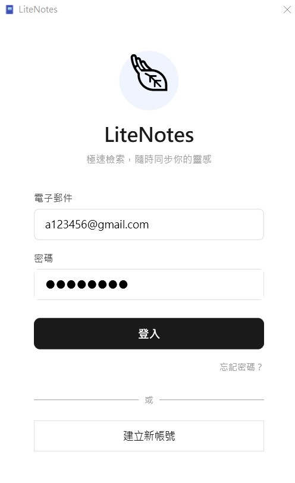
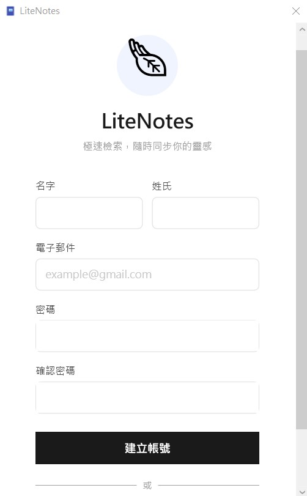
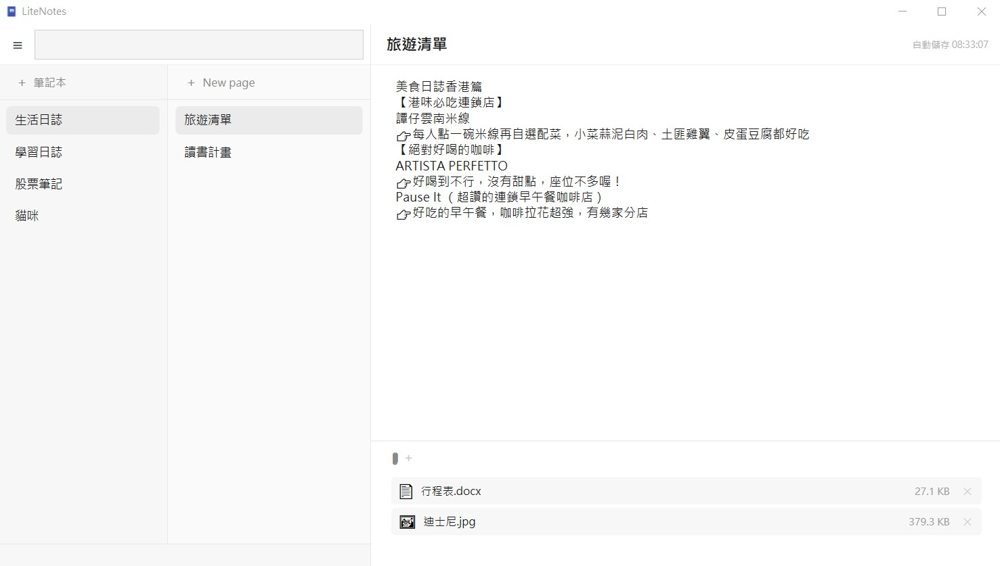
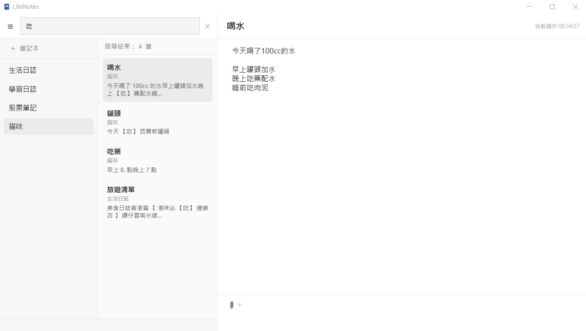
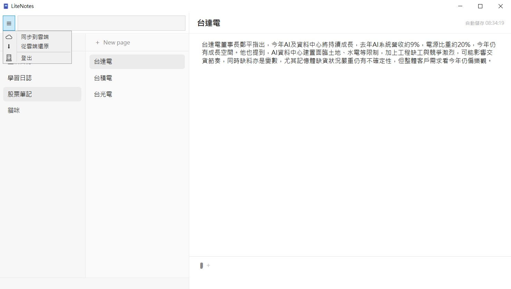

# LiteNotes 📝

一款使用 WPF (.NET 8) 開發的雲端筆記軟體，具備即時全文搜尋、Azure Blob 附件管理、Firebase 雲端同步等功能。

> 此專案為個人面試作品，展示 MVVM 架構設計、Service 層職責分離、雲端服務整合、以及軟體工程的實務開發能力。

## 功能截圖

| 登入畫面 | 註冊畫面 |
|---------|---------|
| 

| 主畫面（筆記編輯 + 附件管理）|
|---------|
||

| 全文搜尋（FTS5 中文斷詞）|
|------|
||

| 漢堡選單（同步 / 還原 / 登出） |
|------|
|  |

---
## 核心功能

- **筆記本與筆記 CRUD** — 新增、重新命名、刪除，支援右鍵選單操作
- **RTF 富文字編輯** — 透過 WPF RichTextBox，支援粗體、斜體、字體大小等格式
- **自動儲存** — 停止輸入 1.5 秒後自動存檔，切換筆記時強制儲存上一篇
- **FTS5 全文搜尋** — 支援中文逐字斷詞，搜尋結果高亮顯示關鍵字片段
- **附件上傳** — 支援圖片（5MB）與文件（20MB）的上傳、下載開啟、軟刪除
- **拖拽上傳** — 直接將檔案拖拽到編輯區即可上傳
- **雲端同步** — 本地變更推送至 Firebase Firestore，支援換機還原
- **Firebase 登入** — 電子郵件登入 / 註冊 / 忘記密碼
- **開發者監控** — 透過 Telegram Bot API 即時推送登入通知

---
## 技術棧

| 類別 | 技術 |
|------|------|
| 框架 | .NET 8 WPF |
| 架構模式 | MVVM（CommunityToolkit.Mvvm） |
| 本地資料庫 | SQLite + Entity Framework Core |
| 雲端資料庫 | Firebase Firestore（REST API） |
| 雲端儲存 | Azure Blob Storage |
| 身份驗證 | Firebase Authentication |
| 全文搜尋 | SQLite FTS5 |
| 日誌系統 | Serilog（Console + File） |
| 依賴注入 | Microsoft.Extensions.DependencyInjection |

---
## 專案結構

```
LiteNotes/
├── Contracts/          介面定義（INotebookService, INoteService, IFileUploadService 等）
├── Converters/         WPF 值轉換器（FileSizeConverter, BoolToVisibilityConverter 等）
├── Data/               EF Core DbContext 與 Migration
├── Helpers/            工具類別（RTF 轉純文字、中文斷詞、檔案格式判斷）
├── Model/              資料模型（Notebook, Note, Attachment, SearchResult）
│   ├── Firebase/       Firebase Auth 的 Request/Response DTO
│   ├── Firestore/      Firestore REST API 的 Document DTO
│   └── Telegram/       Telegram Bot 訊息 DTO
├── Services/           業務邏輯層
│   ├── NotebookService     筆記本 CRUD + 連鎖刪除
│   ├── NoteService         筆記 CRUD + 連鎖刪除附件與索引
│   ├── AzureBlobService    Azure Blob 上傳/下載/刪除
│   ├── FirestoreService    Firestore 雙向同步與還原
│   ├── SearchService       FTS5 全文搜尋索引管理
│   ├── FirebaseAuthService Firebase 身份驗證
│   └── UserSession         使用者狀態管理（Singleton）
├── View/               XAML 視窗與 Code-Behind
├── ViewModel/          MVVM ViewModel（LoginViewModel, NotesViewModel）
└── App.xaml.cs         DI 容器設定、Serilog 初始化、資料庫 Migration

```
---
## 架構設計重點

### 1. Service 層的連鎖刪除（Cascade Soft Delete）

刪除筆記本時，底下的筆記和附件必須跟著被軟刪除。邏輯封裝在 Service 層，ViewModel 不需要知道細節：

```
NotebookService.DeleteNotebookAsync(notebookId)
  → 軟刪除筆記本（主要操作）
  → 逐筆呼叫 NoteService.DeleteNoteAsync（次要操作）
      → 軟刪除筆記
      → 連鎖軟刪除所有附件
      → 清理 FTS5 搜尋索引
```

**設計原則：** 主要操作和次要操作隔離。次要操作失敗只寫 Log，不影響主要操作。不一致會在下次啟動時透過 `RebuildIndexAsync` 自動修復。

### 2. 兩階段刪除（Two-Phase Delete）

```
第一階段（立即）：本地 SQLite 軟刪除（IsDeleted=true, IsSynced=false）
第二階段（延遲）：同步時從 Firestore 刪除記錄 + 從 Azure Blob 刪除檔案
```

`IsSynced` 旗標作為本地和雲端之間的同步契約，確保不遺漏任何待處理的變更。

### 3. 自動儲存的併發控制

```csharp
await _saveLock.WaitAsync();      // SemaphoreSlim 確保同一時間只有一個儲存操作
try { await _noteService.UpdateNoteAsync(note); }
finally { _saveLock.Release(); }

// 索引更新放在鎖外面，避免延長鎖的持有時間
await _searchService.IndexNoteAsync(...);
```

### 4. CancellationToken 防止快速切換的競態問題

```csharp
partial void OnSelectedNoteChanged(Note? value)
{
    _loadAttachmentsCts?.Cancel();  // 取消上一次查詢
    _loadAttachmentsCts = new CancellationTokenSource();
    _ = LoadAttachmentsAsync(value.Id, _loadAttachmentsCts.Token);
}
```

### 5. Firestore 同步的並發控制

使用 `SemaphoreSlim(5, 5)` 限制同時 HTTP 請求數。DB 更新集中在 `Task.WhenAll` 完成後，避免 DbContext 並發競爭：

```csharp
var results = await Task.WhenAll(syncTasks);     // HTTP 並發
foreach (var (entity, success) in results.Where(r => r.success))
    entity.IsSynced = true;                      // DB 更新序列化
await _dbContext.SaveChangesAsync();              // 一次寫入
```

### 6. FTS5 中文全文搜尋

SQLite FTS5 的 `unicode61` tokenizer 無法處理中文，解決方案是逐字斷詞 + RTF Unicode 跳脫序列轉換：

```
RTF 原始內容：\u21488?\u31309?\u-26885?  →  轉換為「台積電」
索引時："台積電" → "台 積 電"（逐字拆開）
搜尋時："台積" → "台 積" → FTS5 MATCH
顯示時："台 積 電" → "台積電"（還原空格）
```

---

## DI 生命週期設計

| Service | 生命週期 | 原因 |
|---------|---------|------|
| EvernoteDbContext | Scoped | EF Core 標準 |
| NotebookService | Scoped | 依賴 DbContext |
| NoteService | Scoped | 依賴 DbContext + SearchService |
| AzureBlobService | Scoped | 必須與其他 Service 共用同一個 DbContext |
| SearchService | Scoped | 依賴 DbContext |
| FirestoreService | Transient | 透過 AddHttpClient 註冊 |
| UserSession | Singleton | 使用者狀態，整個應用程式共用 |

> **關鍵教訓：** 所有依賴 DbContext 的 Service 必須使用 Scoped 生命週期。Singleton 持有的 DbContext 會跟其他 Scoped Service 的 DbContext 不同實例，導致 Change Tracker 快取不同步。

---

## 錯誤處理策略

| 層級 | 處理方式 | 範例 |
|------|---------|------|
| Service（次要操作） | try-catch + Log，不拋例外 | 索引清理失敗、附件連鎖刪除失敗 |
| Service（主要操作） | 不 catch，讓例外往上拋 | 資料庫 CRUD 失敗 |
| ViewModel | catch + 顯示錯誤彈窗 | 刪除失敗、上傳失敗 |
| 同步層（Blob 清理） | try-catch + Warning | Blob 刪除失敗不阻擋同步 |

---

## 日誌系統

- **Console** — 開發用，精簡格式 `[HH:mm:ss LVL] Message`
- **File** — 正式環境，完整格式含 SourceContext，每天自動產生新檔，保留 30 天
- **噪音壓制** — EF Core 和 HttpClient 壓制到 Warning 層級

---

## 如何執行

### 環境需求
- .NET 8 SDK
- Visual Studio 2022
- Azure Storage Account
- Firebase 專案（Authentication + Firestore）

### 設定步驟

1. 複製 `appsettings.example.json` 為 `appsettings.json`
2. 填入設定：

```json
{
  "Firebase": {
    "ApiKey": "your-firebase-api-key",
    "ProjectId": "your-firebase-project-id"
  },
  "Azure": {
    "Storage": {
      "ConnectionString": "your-azure-storage-connection-string",
      "ContainerName": "note-attachments"
    }
  },
  "Telegram": {
    "BotToken": "your-telegram-bot-token",
    "TestChatId": "your-chat-id"
  }
}
```

3. `.net ef database update`
4. `.net run`

---

